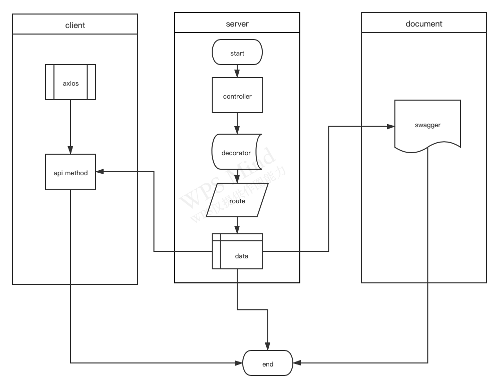

# nuxt-neo-decorator

[![npm version][npm-version-src]][npm-version-href]
[![npm downloads][npm-downloads-src]][npm-downloads-href]
[![Github Actions CI][github-actions-ci-src]][github-actions-ci-href]
[![Codecov][codecov-src]][codecov-href]
[![License][license-src]][license-href]


> Nuxt.js Route Decorators for API Route, universal way to server and client side




[📖 **Release Notes**](./CHANGELOG.md)

## Setup

1. Add `nuxt-neo-decorator` dependency to your project

```bash
yarn add nuxt-neo-decorator # or npm install nuxt-neo-decorator
```

2. Add `nuxt-neo-decorator` to the `modules` section of `nuxt.config.js`

```js
{
  modules: [
    // Simple usage
    'nuxt-neo-decorator',

    // With options
    ['nuxt-neo-decorator', { /* module options */ }]
  ]
}
```

## Development

1. Clone this repository
2. Install dependencies using `yarn install` or `npm install`
3. Start development server using `npm run dev`

## License

[MIT License](./LICENSE)

Copyright (c) Terry Cai 

<!-- Badges -->
[npm-version-src]: https://img.shields.io/npm/v/nuxt-neo-decorator/latest.svg
[npm-version-href]: https://npmjs.com/package/nuxt-neo-decorator

[npm-downloads-src]: https://img.shields.io/npm/dt/nuxt-neo-decorator.svg
[npm-downloads-href]: https://npmjs.com/package/nuxt-neo-decorator

[github-actions-ci-src]: https://github.com//workflows/ci/badge.svg
[github-actions-ci-href]: https://github.com//actions?query=workflow%3Aci

[codecov-src]: https://img.shields.io/codecov/c/github/.svg
[codecov-href]: https://codecov.io/gh/

[license-src]: https://img.shields.io/npm/l/nuxt-neo-decorator.svg
[license-href]: https://npmjs.com/package/nuxt-neo-decorator


